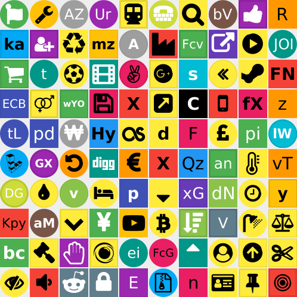

# icon-generator
A simple library for generating Java2D (Swing/AWT) and JavaFX icons in Java, with [SWT](https://github.com/sshtools/icon-generator-swt) support in an add-on. 



icon-generator generates icons images automatically from text or icons with customisable shapes, colour
and styles.

## Configuring your project

The library is available in Maven Central, so configure your project according to the
build system you use. For example, for Maven itself :-

```xml
<dependencies>
	<dependency>
		<groupId>com.sshtools</groupId>
		<artifactId>icon-generator</artifactId>
		<version>1.0.0</version>
	</dependency>
</dependencies>
```

## Configuring the Icon

For this, you use [IconBuilder](src/main/java/com/sshtools/icongenerator/IconBuilder.java). 

### Create The Builder 

```java
IconBuilder builder = new IconBuilder();
```

### Sizes

```java
builder.width(64);
builder.height(64);
```

### Text Colours

```java

builder.textColor(0xff0000); // red

// or

build.textColor(IconBuilder.AUTO_TEXT_COLOR);

// or

build.textColor(IconBuilder.AUTO_TEXT_COLOR_WHITE);

// or

build.textColor(IconBuilder.AUTO_TEXT_COLOR_BLACK);

// and the background colour

builder.color(0x00ff00); // green
```


### Shape

```java

builder.rect(); // rectangle

// or 

builder.round(); // round
// or 

builder.rectRound(8); // rounded rectangle with 8px radius
```

### Text And Fonts

```java

builder.text("AB");
builder.font("Monospaced");
builder.fontSize(12); 
builder.bold(true);

```

### Font Awesome Icon

```java
builder.icon(AwesomeIcon.ADDRESS_BOOK);
```

## Generate The Icon

Now you can use the IconBuilder.build() for the toolkit you are using.
Currently only the Java2D toolkit (*java.awt.BufferedImage*
and *javax.swing.Icon*) and JavaFX (*javafx.scene.canvas.Canvas*) implementations
are provided in this core module, but there is an SWT add-on (*icon-generator-swt*)
and other toolkit implementations may be released later.

### Generate an ImageIcon for use in Swing

```
JLabel l = new JLabel("A label with an icon");
l.setIcon(builder.build(Icon.class));
```

### Generate a Java2D BufferedImage for use in a servlet

Something like this :- 

```java
response.setContentType("image/jpeg");
try(OutputStream out = response.getOutputStream()) {
	ImageIO.write(builder.build(BufferedImage.class), "jpg", out);
}

```

## Extending

New generators may be added by implementing [IconGenerator](src/main/java/com/sshtools/icongenerator/IconGenerator.java).
You can then either add the generator to each IconBuilder you create :-

```java
builder.generator(MyIcon.class, new IconGenerator<MyIcon>() {
	@Override
	public Class<MyIcon> getIconClass() {
		return MyIcon.class;
	}

	@Override
	public MyIcon generate(IconBuilder builder, Object... args) {
		MyIcon myIcon = ..
		
		/** Do stuff to generate a MyIcon given the configuration provided by IconBuilder */ 
	
	
		return myIcon;
	}
	
});
```

.. or create a concrete class and add it as a service. Create a classpath resource named *META-INF/services/com.sshtools.icongenerator.IconGenerator* (e.g. src/main/resources/META-INF/services/com.sshtools.icongenerator.IconGenerator) and place the full class name of your IconGenerator implementation inside it. 

```
com.mystuff.icongen.MyIconGenerator
```

This will then be automatically loaded whenever you create a new IconBuilder instance, and you can use the *build()*
method as normal :-

```java
IconBuilder builder = new IconBuilder();

// do stuff to create builder ...

MyIcon myIcon = builder.build(MyIcon.class);
```

The *build()* method also can accept additional arguments which are passed on to the generator, if your generator
needs additional configuration.

```java

MyIcon myIcon = builder.build(MyIcon.class, flipX, flipY);
```

.. and then in the generator access the arguments :-

```java
@Override
	public MyIcon generate(IconBuilder builder, Object... args) {
		boolean flipX = (Boolean)args[0];
		boolean flipY = (Boolean)args[1];
		MyIcon myIcon = ..
		
		/** Do stuff to generate a MyIcon given the configuration provided by IconBuilder */ 
	
		return myIcon;
	}
```
